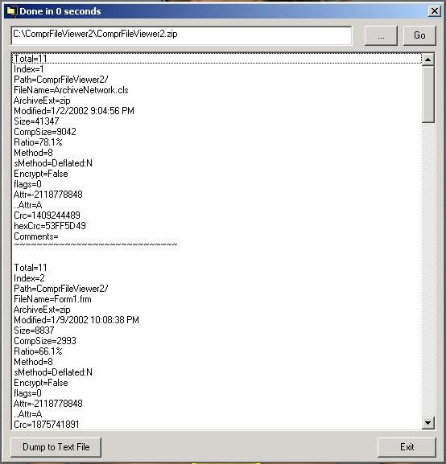



## Compressed File Viewer

### Description

Stripped code from Dana Seaman's FolderView project. I stripped the project so that the result was only the code that enumerated compressed files. With this code you can view the contents of compressed files (zip, cab, rar, and ace). Note that this code does not compress or uncompress files, it simply enumerates the contents of the compressed files. Also works with shared files over a network. Dana 's original code is at:

http://www.planet-source-code.com/xq/ASP/txtCodeId.23292/lngWId.1/qx/vb/scripts/ShowCode.htm

All of the code here is Dana's except for the minor stuff like the "Dump to Text File"

subroutine and the browsing function. You will notice that there are alot of variables that

have been commented out. Those are just the byproducts of the original and bigger project.

They were not needed for the compressed file enumeration but i left them in the code. I want to personally thank Dana for such good work.
 
### More Info
 

             |
---                |---
**Submitted On**   |2002-01-09 22:10:06
**By**             |[El Mariachi](https://github.com/Planet-Source-Code/PSCIndex/blob/master/ByAuthor/el-mariachi.md)
**Level**          |Advanced
**User Rating**    |5.0 (30 globes from 6 users)
**Compatibility**  |VB 6\.0
**Category**       |[Files/ File Controls/ Input/ Output](https://github.com/Planet-Source-Code/PSCIndex/blob/master/ByCategory/files-file-controls-input-output__1-3.md)
**World**          |[Visual Basic](https://github.com/Planet-Source-Code/PSCIndex/blob/master/ByWorld/visual-basic.md)
**Archive File**   |[Compressed47536192002\.zip](https://github.com/Planet-Source-Code/el-mariachi-compressed-file-viewer__1-30635/archive/master.zip)

### API Declarations

too many to list

